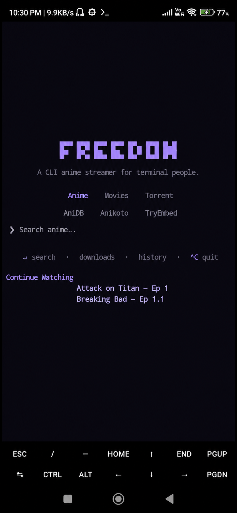

# Freedom

**Freedom** is an **anime and movie streaming** app for **Android** (arm64). Search across multiple providers, **stream** or **download** content, and play it back with a built-in hardware-accelerated **MPV** player — all from a terminal TUI with torrent streaming and plugin-based providers.

This is the **Android** build. The cross-platform terminal version lives in the [Freedom](https://github.com/Eskoxx/Freedom) repo.

## Contents

- [For Users](#for-users)
  - [What You Can Do](#what-you-can-do)
  - [Getting Started](#getting-started)
  - [Keybindings](#keybindings)
  - [Requirements](#requirements)
  - [Updating](#updating)
  - [Known Limitations](#known-limitations)
- [For Developers and AI Agents](#for-developers-and-ai-agents)

## For Users

### What You Can Do

- **Search** — search for any anime, movie, or show across multiple online providers, or pick a specific provider to search individually
- **Stream** — play videos directly on your phone with the built-in MPV player (supports gestures for brightness, volume, and seeking). Most providers offer multiple quality options (360p, 720p, 1080p) — toggle with the `v` key
- **Torrents** — search torrent sites with two separate categories: torrent-anime (Nyaa) and torrent-movies (TPB, EZTV); stream magnet links via built-in webtorrent (no external torrent client needed)
- **Download** — save content to your device for offline viewing
- **Resume** — watch history is maintained so you can pick up where you left off
- **Plugin system** — write and load custom provider plugins without modifying the app

### Getting Started

> If you find this useful, please **star the repo** ⭐ — it helps others discover it.

1. **Download the APK** — grab the latest **arm64** release from the [Releases page](https://github.com/Eskoxx/Freedom-Android/releases/latest) (or build from source — see [`instructions.md`](instructions.md)). **Note:** the APK is built **only for arm64** (arm64-v8a) devices — it will not install on 32-bit or x86 devices.
2. **Install** the APK on your Android device (Android 7+ required, Android 12+ recommended with phantom process limits disabled — see [Termux docs](https://github.com/termux/termux-app/issues/2366)).
3. **Open** the app. On first launch, the bootstrap installer runs automatically — **be patient and wait up to 2 minutes** so all bootstrap packages (Python 3.14, Node.js 26, mpv, and all dependencies) get installed. The TUI then **loads automatically**.
4. **Grant permissions** when prompted:
   - **Overlay permission** — required for the MPV video player (enable "Display over other apps").
   - **Notification permission** — required for playback/download notifications.
5. The TUI always starts automatically when you open the app (if it's installed).

The TUI (Textual User Interface) is keyboard-driven across several screens:

### Keybindings

**Global / Splash Screen:**
| Key | Action |
|---|---|
| Type + `Enter` | Search |
| `h` | View watch history |
| `Tab` / click | Switch category (Anime / Movies / Torrent) |
| `Ctrl+C` or `Escape` | Quit |

**Browser Screen (search results, episodes):**
| Key | Action |
|---|---|
| `↑`/`↓` or `k`/`j` | Navigate list |
| `Enter` | Select / open next level |
| `/` | Focus search bar |
| `s` | Toggle sidebar |
| `L` | View downloads |
| `h` | View history |
| `←`/`→` | Switch category |
| `a` | Toggle audio sub / dub (anime section) |
| `v` | Toggle quality (1080p / 720p / 360p or 480p — lowest quality varies by provider) |
| `d` | Download current item |
| `Escape` | Go back |
| `q` or `Ctrl+C` | Quit |

**Stream Picker / Episode Picker:**
| Key | Action |
|---|---|
| `↑`/`↓` or `k`/`j` | Navigate list |
| `Enter` | Select stream / episode |
| `Escape` | Go back |
| `q` or `Ctrl+C` | Quit |

**Download Operation Screen:**
| Key | Action |
|---|---|
| `↑`/`↓` or `k`/`j` | Navigate list |
| `Enter` | Activate selected |
| `p` | Pause / resume download |
| `x` | Cancel download |
| `d` | Delete file from disk |
| `w` | Watch completed download |
| `Escape` | Go back |
| `q` or `Ctrl+C` | Quit |

**Torrent Operation Screen:**
| Key | Action |
|---|---|
| `Escape` | Close |
| `Ctrl+C` | Quit |

### Requirements

- Android 7.0+
- **arm64** (arm64-v8a) device — the APK is built only for arm64
- ~500MB free internal storage (for the app and bootstrap)
- Internet connection (for streaming)
- **Recommended for Wi-Fi users** — streaming uses a lot of mobile data
- Be patient: playback can take up to **10 seconds** to start
- For torrents: active internet with DHT/tracker access

### Updating

Installing a newer APK over an existing installation (`adb install -r` or side-loading) works fine — the app assets are refreshed on every startup. The bootstrap packages are only installed once (guarded by a marker file), so existing system packages won't be re-installed. To force a full re-setup: delete the marker file (`rm $HOME/.freedom_setup_done` inside the app) and restart.

### Known Limitations

- Android 12+ may kill background processes (the "signal 9" issue). See [Termux phantom process docs](https://github.com/termux/termux-app/issues/2366) for workarounds.
- Torrent streaming requires at least one active seeder on the magnet link.
- Some providers require cookies to function.
- The app works best on a tablet or landscape orientation for the terminal UI.
- Search can occasionally return no results — just try searching again, a fresh request often works.
- Torrent downloads have **no progress bar yet** (not implemented).
- The project is refined primarily for **streaming**; downloading works for most providers but is not thoroughly configured.
- The 11 built-in providers are **temporary** — they work as of 31 July 2026 but can break at any time.

---

> **This is a fun side project, not a product.** The built-in streaming providers (scrapers) are brittle — they scrape undocumented websites that change without warning, and **will** break over time. I cannot maintain this forever. The real goal of this project is the **plugin system**: anyone can write their own provider plugin without modifying the app. If a provider breaks, fix it yourself, share it, or write a new one. The plugin system is the part that lasts; the providers are just examples. And if you're a technical person, none of this matters — everything is editable; just change the files.

## For Developers and AI Agents

See [`instructions.md`](instructions.md) — it covers architecture, building, ADB debugging, asset deployment, the torrent engine, provider system, key files, and development workflow.

---

## Disclaimer

Freedom is not hosting any kind of content and the developer(s) of this application does not have any affiliation with the content providers that are freely available in the internet.
